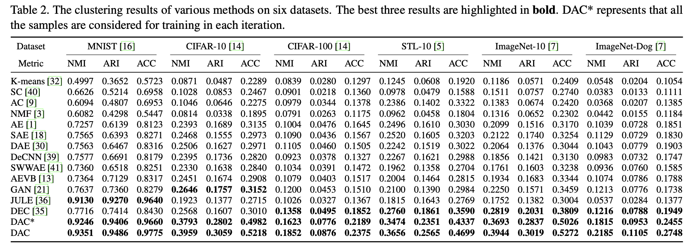

# Deep Adaptive Image Clustering (DAC)
***

**New**: Pytorch version of DAC has been re-implemented on MNIST [2019/11/29], and will updated in the near future. 

Pytorch Implementation of  Deep Adaptive Image Clustering. Since **NO OFFICIAL** version of Pytorch provided, i implemenent **my pytorch version** with the help of [DAC Tensorflow](https://github.com/vector-1127/DAC) from author and setting in the paper [Deep Adaptive Image Clustering](http://openaccess.thecvf.com/content_ICCV_2017/papers/Chang_Deep_Adaptive_Image_ICCV_2017_paper.pdf) .

!! Something **confusing**: Although i could reprodce the result reported in paper on MNIST dataset,  i could not achieve the same thing on Cifar. Even i ran tensorflow version provided by author, so did it. If anyone can reproduce result on Cifar10, plz contact me ~!!

## Directory

If you want to run these code, you need to clone and create directory like below:

```bash
.
├── README.md
├── data
├── requirement.txt
├── scripts
├── src
├── tags
└── tmp
```

You can construct dataset (h5py) by using *CreateDataset.ipynb* in tmp, or just download from [Google Driver](https://drive.google.com/open?id=1ouT_RdbbUTBCfRlftRDW9UNbySrBdHRA).

## Requirements

1. Python 3.6
2. Nvidia 418+ \& Cuda10.1+/Cuda9.2+
3. Install python package in requirements.txt by command below

```
pip install -r requirements.txt
```

## Run

You can change hyperparater in the scripts. 

```bash
bash ./scripts/Exp_111.sh
```

## Performance 



ACC, NMI, and ARI on MNIST can be achieved very closely to what reported in paper, but not so stable.

My implementation can reach 96.68(ACC), 93.49(ARI), 93.7(NMI) within 20 epochs. Details can be found in *scripts* directory. You can also download logfile and models from [Google Drviver](https://drive.google.com/open?id=1d-8J6naXTE3d04f6ORO4qntycyib-nSW). 


## License

***

This re-implementation follows BSD License. 

